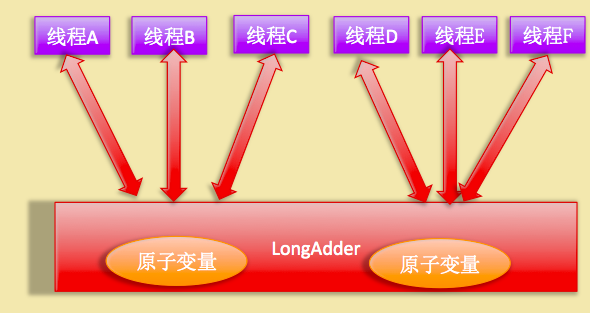

# Java8新特性简要概述

## Lambda表达式

### 参数行为化
我们先来例子：
``` java
// 更具颜色来筛选苹果
static List<Apple> filterAppleByColor(List<Apple> inventory, String color) {
    List<Apple> result = new ArrayList<>();
    for (Apple apple : inventory) {
        if (color.equals(apple.getColor())) {
            result.add(apple);
        }
    }
    return result;
}


// 根据重量来筛选苹果
static List<Apple> filterAppleByWeight(List<Apple> inventory, int weight) {
    List<Apple> result = new ArrayList<>();
    for (Apple apple : inventory) {
        if (apple.getWeight() >= weight) {
            result.add(apple);
        }
    }
    return result;
}
```

我们在`根据颜色来筛选苹果`和`根据重量来筛选苹果`观察到核心的逻辑主要的区别在于
``` java
color.equals(apple.getColor())

apple.getWeight() >= weight
```

此时我们定义一个接口来实现核心的逻辑部分：
``` java
public interface ApplePredicate {
    boolean test(Apple apple);
}

// 颜色筛选
public class AppleColorPredicate implements ApplePredicate {
    @Override
    public boolean test(Apple apple) {
        return "green".equalsIgnoreCase(apple.getColor());
    }
}

// 重量筛选
public class AppleWeightPredicate implements ApplePredicate {
    @Override
    public boolean test(Apple apple) {
        return apple.getWeight() > 150;
    }
}
```
这时我们的筛选实现逻辑就是这样的：
``` java
// 根据接口的不同实现，来进行筛选
static List<Apple> filterApple(ApplePredicate predicate) {
    List<Apple> result = new ArrayList<>();
    for (Apple apple : inventory) {
        if (predicate.test(apple)) {
            result.add(apple);
        }
    }
    return result;
}
```
上面的这一套东西就是解释行为参数化，如下图：


### 演进到lambda表达式

- 使用匿名类

    上面在行为参数化的过程中，我们实现两个不同的参数行为，但是还是显得比较啰嗦，如果我们有N种不同的行为那么就需要N种不同接口实现类。如果我们使用匿名类，就避免实现过多的类。
    ``` java
    // 通过使用匿名类来实现行为参数化
    filterApple(new ApplePredicate() {
            @Override
            public boolean test(Apple apple) {
                return apple.getWeight() > 150 && "green".equalsIgnoreCase(apple.getColor());
            }
        })
    ```
    通过匿名类虽然使得实现类的数量减少，但是代码臃肿，不够简洁。

- 使用Lambda表达式

    ``` java
    filterApple((Apple apple) ->  apple.getWeight() > 150);
    ```

    Lambda表达式简介直观易于理解，在表达式里面，可以自由的进行核心逻辑的实现。

### lambda表达式

#### lambda表达式结构

把lambda表达式理解为简洁地表示可传递匿名函数的一种方式：他没有名称，有参数列表，函数主体，返回类型。lambda表达式具有以下的特征：

- 匿名。不会像普通方法那样有一个明确的名称。
- 函数。lambda表达式具有函数的特征：有参数列表，函数主体，返回类型，甚至可以抛出异常。
- 传递。lambda表达式作为参数传递给方法。
- 简洁。lambda表达式简洁明了，核心逻辑直接曝露。

lambda的结构形式：

参见：Comparator接口的lambda表达式


#### 怎样以及在哪里使用lambda表达式

什么情况下才可以使用lambda表达式？函数式接口。只要这个方法接受的参数是函数式接口，就可以传递lambda表达式。

那么什么是函数时接口？一句话：就是只有一个抽象方法的接口。像这样的接口

``` java
public interface Predicate<T> {
    boolean test(T t);
}

public interface Runnable {
    void run();
}
```

下面我们来看一个怎样使用lambda表达式的过程：

1. 行为参数化
2. 使用函数式接口传递行为
3. 执行行为
4. 传递lambda表达式


    
#### 内置的函数时接口


函数式接口的示例


#### 函数式接口的方法引用

比如我们对仓库中的苹果按重量排序：

``` java
// 常规lambda
inventory.sort((a1, a2) -> Integer.compare(a1.getWeight(), a2.getWeight()) );
// 方法引用
inventory.sort(Comparator.comparing(Apple::getWeight));
```

通过方法应用的方式，代码更加的直观，简洁。看一些方法引用的例子。


构造方法引用主要有3类：

- 指向`静态方法`的方法引用（Integer::parseInt）。
    ``` java
    (String i) -> Integet.parseInt(i)
    等同于
    Integer::parseInt
    ```
- 指向`任意类型实例方法`的方法引用（String::length）。
    ``` java
    (String s) -> s.length()
    等同于
    String::length
    ```
- 指向`现有对象的实例方法`的方法引用。
    ``` java
    String ss = "123456789";
    Function<Integer, Integer> f= (Integer i) -> ss.indexOf(i);
    等同于
    Function<Integer, Integer> f1= ss::indexOf;
    ```

## Stream

### 引入流
Java8新添加了一个特性：流Stream。Stream让开发者能够以一种声明的方式处理数据源（集合、数组等），它专注于对数据源进行各种高效的聚合操作（aggregate operation）和大批量数据操作 (bulk data operation)。

Stream API将处理的数据源看做一种Stream（流），Stream（流）在Pipeline（管道）中传输和运算，支持的运算包含筛选、排序、聚合等，当到达终点后便得到最终的处理结果。
几个关键概念：

    1. 元素Stream是一个来自数据源的元素队列，Stream本身并不存储元素。
    2. 数据源（即Stream的来源）包含集合、数组、I/O channel、generator（发生器）等。
    3. 聚合操作 类似SQL中的filter、map、find、match、sorted等操作
    4. 管道运算 Stream在Pipeline中运算后返回Stream对象本身，这样多个操作串联成一个Pipeline，并形成fluent风格的代码。这种方式可以优化操作，如延迟执行(laziness)和短路( short-circuiting)。
    5. 内部迭代 不同于java8以前对集合的遍历方式（外部迭代），Stream API采用访问者模式（Visitor）实现了内部迭代。
    6. 并行运算 Stream API支持串行（stream() ）或并行（parallelStream() ）的两种操作方式。

Stream API的特点：

    1. Stream API的使用和同样是java8新特性的lambda表达式密不可分，可以大大提高编码效率和代码可读性。
    2. Stream API提供串行和并行两种操作，其中并行操作能发挥多核处理器的优势，使用fork/join的方式进行并行操作以提高运行速度。
    3. Stream API进行并行操作无需编写多线程代码即可写出高效的并发程序，且通常可避免多线程代码出错的问题。

创建流的几种方式：
``` java
Stream<String> stream;

// 生成空白的流
stream = Stream.empty();
// 通过静态方法生成
stream = Stream.of("A", "B", "C");
// 从集合生成流
List<String> list = new ArrayList<>();
stream = list.stream();
// 从数组生成流
String[] a = new String[]{"A", "B", "C"};
stream = Arrays.stream(a);
// 从文件创建流
try (Stream<String> lines = Files.lines(Paths.get("BasicFileOutput.out"))) {
    System.out.println(lines.flatMap(v -> Arrays.stream(v.split(" "))).count());
} catch (IOException e) {
    e.printStackTrace();
}
// 函数生成流
Stream.iterate(1, n -> n << 1).limit(10).forEach(System.out::println);
Stream.generate(Math::random).limit(3).forEach(System.out::println);
```

### 使用流
对流的操作一般包含三步操作：
- 一个`数据源`来执行一个查询
- 一个`中间操作链`，形成一条流的流水线
- 一个`终端操作`，执行流水线，并能生成结果

在前面我们已经介绍过通过不同的方式来生成流了，那么什么是中间操作，什么是终端操作。
> 中间操作：中间操作对流的处理生成的依旧是流，可以通过不同的中间操作组合成不同的逻辑需求。

> 终端操作：通过终端操作后，流被消耗殆尽，生成对应的结果

中间操作和终端操作表视图：


下面简单介绍中间操作

filter & limit
``` java
// 筛选出2011年的交易
TRANSACTION_LIST.stream().filter(v -> v.getYear() == 2011).forEach(System.out::println);

// 筛选出2011年的前3笔交易
TRANSACTION_LIST.stream().filter(v -> v.getYear() == 2011).limit(3).forEach(System.out::println);
```

map & distinct
``` java
// 交易员再那些不同的城市工作过
TRANSACTION_LIST.stream().map(v -> v.getTrader().getCity()).distinct().forEach(System.out::println);
```

allMatch & anyMatch & noneMatch & findFirst & findAny
``` java
if (menu.stream().anyMatch(v -> v.getCalories() < 100)) {
    print("这个菜单有低热量的食品");
}

if (menu.stream().allMatch(v -> v.getPrice() < 100)) {
    print("这边的食品的价格都小于100元");
}

if (menu.stream().noneMatch(v -> "大白菜".equals(v.getName()))) {
    print("没有大白菜这个菜");
}

menu.stream().filter(v -> v.getCalories() > 100).findAny().orElse(null);
menu.stream().filter(v -> v.getCalories() > 100).findFirst().orElse(null);
```
### 收集流

所有的流，在经过一系列中间操作后，都要终端操作进行规约汇总。常用的这些操作有哪些？

> count, max , min
``` java
print("===================交易的数据数量==========================");
print(list.stream().collect(Collectors.counting()));

print("===================最大交易额==========================");
Optional<Transaction> transactionMax = list.stream().collect(Collectors.maxBy(Comparator.comparingLong(Transaction::getAmount)));
print("===================最小交易额==========================");
Optional<Transaction> transactionMin = list.stream().collect(Collectors.minBy(Comparator.comparingLong(Transaction::getAmount)));
```

> 汇总
``` java
print("===================汇总：求和==========================");
print(list.stream().collect(Collectors.summingLong(Transaction::getAmount)));
print("===================汇总：平均==========================");
print(list.stream().collect(Collectors.averagingLong(Transaction::getAmount)));
print("===================汇总：概要==========================");
print(list.stream().collect(Collectors.summarizingLong(Transaction::getAmount)));
```

> 连接
``` java
print("===================连接==========================");
print(list.stream().map(Transaction::getCity).distinct().collect(Collectors.joining(" ")));
```

> 分组/分区
``` java
print("===================按照城市进行分组=================");
print(list.stream().collect(Collectors.groupingBy(Transaction::getCity)));

print("===================自定义分类函数的分组==================");
print(list.stream().collect(Collectors.groupingBy(transaction -> {
    if (transaction.getAmount() >= 1000) {
        return "High";
    } else {
        return "Low";
    }
})));

print("===================先按照城市再按照金额高低(多级分组)=======================");
print(list.stream().collect(Collectors.groupingBy(Transaction::getCity, Collectors.groupingBy(transaction -> {
    if (transaction.getAmount() >= 1000) {
        return "High";
    } else {
        return "Low";
    }
}, Collectors.counting()))));

print("===============================分区（分组的特殊情况）=====================================");
Map<Boolean, List<Transaction>> cityPart1 = list.stream().collect(Collectors.partitioningBy(v -> "Chengdu".equals(v.getCity())));
```

### 并行流
在stream中使用并行流非常的方便，通过parallel()方法就可以使用并行流。

下面我们来看使用并行流的示例：
``` java
int n = 100_000_000
LongStream.rangeClosed(0, n).sum();
LongStream.rangeClosed(0, n).parallel().sum();

seq执行时间：35 ms
parallel执行时间：6 ms
```
可以看到使用并行流的方式非常的简单。并行流能够非常迅速的提升性能，但是在使用并行流是要注意几点：

- 对并行流的结果有疑问时，尽可能的做更多的测试。
- 注意自动的装箱拆箱。因为装箱拆箱操作会降低性能，尽可能的使用（IntStream,LongStream等）来避免。
- 当数据量较小时，并行化造成的开销使性能比串行化低。
- 同时要考虑流背后的数据结构是否易于分解。

列举不同数据结构的并行化分解情况：


## Java8新增API
### Optional
从 Java 8 引入的一个很有趣的特性是 Optional  类。Optional 类主要解决的问题是臭名昭著的空指针异常（NullPointerException）。

本质上，这是一个包含有可选值的包装类，这意味着 Optional 类既可以含有对象也可以为空。

Java8之前：处理NullPointerException是这样的：
``` java
public static String getGender(Student student)
{
    if(null == student)
    {
        return "Unkown";
    }
    return student.getGender();
    
}
```
这样的代码显得臃肿，不够直观，为了解决空指针异常同时精简代码，Java8引入了Optional类，处理空指针异常的方式是这样的。

``` java
public static String getGender(Student student)
{
    return Optional.ofNullable(student).map(u -> u.getGender()).orElse("Unkown");
    
}
```

 可以看到，Optional类结合lambda表达式的使用能够让开发出的代码更简洁和优雅。

Optional类组成结构如下图：


#### Optional创建
``` java
// 1、创建一个包装对象值为空的Optional对象
Optional<String> optStr = Optional.empty();
// 2、创建包装对象值非空的Optional对象
Optional<String> optStr1 = Optional.of("optional");
// 3、创建包装对象值允许为空的Optional对象
Optional<String> optStr2 = Optional.ofNullable(null);
```
#### Optional使用

##### get方法
``` java
public T get() {
    if (value == null) {
        throw new NoSuchElementException("No value present");
    }
    return value;
}
```
可以看到，get()方法主要用于返回包装对象的实际值，但是如果包装对象值为null，会抛出NoSuchElementException异常。

##### isPresent方法
``` java
public boolean isPresent() {
    return value != null;
}
```
可以看到，isPresent()方法用于判断包装对象的值是否非空。下面我们来看一段糟糕的代码：
``` java
public static String getGender(Student student)
{
    Optional<Student> stuOpt =  Optional.ofNullable(student);
    if(stuOpt.isPresent())
    {
        return stuOpt.get().getGender();
    }
    
    return "Unkown";
}
```
这种用法不但没有减少null的防御性检查，而且增加了Optional包装的过程，违背了Optional设计的初衷，因此开发中要避免这种糟糕的使用

##### ifPresent方法
``` java
public void ifPresent(Consumer<? super T> consumer) {
    if (value != null)
        consumer.accept(value);
}
```
ifPresent()方法接受一个Consumer对象（消费函数），如果包装对象的值非空，运行Consumer对象的accept()方法。示例如下：
``` java
public static void printName(Student student)
{
    Optional.ofNullable(student).ifPresent(u ->  System.out.println("The student name is : " + u.getName()));
}
```
上述示例用于打印学生姓名，由于ifPresent()方法内部做了null值检查，调用前无需担心NPE问题。

##### filter方法
``` java
public Optional<T> filter(Predicate<? super T> predicate) {
    Objects.requireNonNull(predicate);
    if (!isPresent())
        return this;
    else
        return predicate.test(value) ? this : empty();
}
```
filter()方法接受参数为Predicate对象，用于对Optional对象进行过滤，如果符合Predicate的条件，返回Optional对象本身，否则返回一个空的Optional对象。举例如下：
``` java
public static void filterAge(Student student)
{
    Optional.ofNullable(student).filter( u -> u.getAge() > 18).ifPresent(u ->  System.out.println("The student age is more than 18."));
}
```
##### map方法
``` java
public<U> Optional<U> map(Function<? super T, ? extends U> mapper) {
    Objects.requireNonNull(mapper);
    if (!isPresent())
        return empty();
    else {
        return Optional.ofNullable(mapper.apply(value));
    }
}
```
map()方法的参数为Function（函数式接口）对象，map()方法将Optional中的包装对象用Function函数进行运算，并包装成新的Optional对象（包装对象的类型可能改变）。举例如下：
``` java
public static Optional<Integer> getAge(Student student)
{
    return Optional.ofNullable(student).map(u -> u.getAge()); 
}
```
上述代码中，先用ofNullable()方法构造一个Optional<Student>对象，然后用map()计算学生的年龄，返回Optional<Integer>对象（如果student为null, 返回map()方法返回一个空的Optinal对象）。
##### flatMap方法
``` java
public<U> Optional<U> flatMap(Function<? super T, Optional<U>> mapper) {
    Objects.requireNonNull(mapper);
    if (!isPresent())
        return empty();
    else {
        return Objects.requireNonNull(mapper.apply(value));
    }
}
```
跟map()方法不同的是，入参Function函数的返回值类型为`Optional<U>`类型，而不是U类型，这样flatMap()能将一个二维的Optional对象映射成一个一维的对象。以3.5中示例功能为例，进行faltMap()改写如下：
``` java
public static Optional<Integer> getAge(Student student)
{
    return Optional.ofNullable(student).flatMap(u -> Optional.ofNullable(u.getAge())); 
}
```
##### orElse方法
``` java
public T orElse(T other) {
    return value != null ? value : other;
}
```    
orElse()方法功能比较简单，即如果包装对象值非空，返回包装对象值，否则返回入参other的值（默认值）。如第一章（简介）中提到的代码：
``` java
public static String getGender(Student student)
{
    return Optional.ofNullable(student).map(u -> u.getGender()).orElse("Unkown");
    
}
```
##### orElseGet方法
``` java
public T orElseGet(Supplier<? extends T> other) {
    return value != null ? value : other.get();
}
```
orElseGet()方法与orElse()方法类似，区别在于orElseGet()方法的入参为一个Supplier对象，用Supplier对象的get()方法的返回值作为默认值。如：
``` java
public static String getGender(Student student)
{
    return Optional.ofNullable(student).map(u -> u.getGender()).orElseGet(() -> "Unkown");      
}
```
##### orElseThrow方法
``` java
public <X extends Throwable> T orElseThrow(Supplier<? extends X> exceptionSupplier) throws X {
    if (value != null) {
        return value;
    } else {
        throw exceptionSupplier.get();
    }
}
```
orElseThrow()方法其实与orElseGet()方法非常相似了，入参都是Supplier对象，只不过orElseThrow()的Supplier对象必须返回一个Throwable异常，并在orElseThrow()中将异常抛出：
``` java
public static String getGender1(Student student)
{
    return Optional.ofNullable(student).map(u -> u.getGender()).orElseThrow(() -> new RuntimeException("Unkown"));      
}
```
orElseThrow()方法适用于包装对象值为空时需要抛出特定异常的场景。
#### 注意事项
使用Optional开发时要注意正确使用Optional的“姿势”，特别注意不要使用3.2节提到的错误示范，谨慎使用isPresent()和get()方法，尽量多使用map()、filter()、orElse()等方法来发挥Optional的作用。

### Date/Time
java8里面新增了一套处理时间和日期的API，为什么要搞一套全新的API呢，因为原来的java.util.Date以及Calendar实在是太难用了。

举个简单的小栗子：

如果你需要查询当前周的订单，那么你需要先获取本地时间，然后根据本地时间获取一个Calendar，然后对Calendar进行一些时间上的加减操作，然后获取Calendar中的时间。

而在java8中，你只需要这样：
``` java
LocalDate date = LocalDate.now();
//当前时间减去今天是周几
LocalDate start = date.minusDays(date.getDayOfWeek().getValue());
//当前时间加上（8-今天周几）
LocalDate end = date.plusDays(8 -date.getDayOfWeek().getValue());
```
Java8中提供真正的日期，时间分割开来的操作，LocalDate是日期相关操作，LocalTime是时间(即每天24个小时)的操作。想要获取时间及日期的话请使用LocalDateTime.

#### LocalDate
``` java
// 取当前日期：
LocalDate today = LocalDate.now(); // -> 2014-12-24
// 根据年月日取日期，12月就是12：
LocalDate crischristmas = LocalDate.of(2014, 12, 25); // -> 2014-12-25
// 根据字符串取：
LocalDate endOfFeb = LocalDate.parse("2014-02-28"); // 严格按照ISO yyyy-MM-dd验证，02写成2都不行，当然也有一个重载方法允许自己定义格式
LocalDate.parse("2014-02-29"); // 无效日期无法通过：DateTimeParseException: Invalid date
```
日期转换：
``` java
// 取本月第1天：
LocalDate firstDayOfThisMonth = today.with(TemporalAdjusters.firstDayOfMonth()); // 2014-12-01
// 取本月第2天：
LocalDate secondDayOfThisMonth = today.withDayOfMonth(2); // 2014-12-02
// 取本月最后一天，再也不用计算是28，29，30还是31：
LocalDate lastDayOfThisMonth = today.with(TemporalAdjusters.lastDayOfMonth()); // 2014-12-31
// 取下一天：
LocalDate firstDayOf2015 = lastDayOfThisMonth.plusDays(1); // 变成了2015-01-01
// 取2015年1月第一个周一，这个计算用Calendar要死掉很多脑细胞：
LocalDate firstMondayOf2015 = LocalDate.parse("2015-01-01").with(TemporalAdjusters.firstInMonth(DayOfWeek.MONDAY)); // 2015-01-05
```

#### LocalTime
``` java
//包含毫秒
LocalTime now = LocalTime.now(); // 11:09:09.240
//不包含毫秒  
LocalTime now = LocalTime.now().withNano(0)); // 11:09:09
//构造时间  
LocalTime zero = LocalTime.of(0, 0, 0); // 00:00:00
LocalTime mid = LocalTime.parse("12:00:00"); // 12:00:00
```
LocalDateTime的很多操作都和LocalDate差不多，具体的请查看一下源码就秒懂了。

#### Instant

Date-Time API 的核心类之一是 Instant 类，它表示时间轴上的纳秒开始。此类对于生成表示机器时间的时间戳很有用。
``` java
Instant timestamp = Instant.now();
```
Instant 类返回的值计算从 1970 年 1 月 1 日（1970-01-01T00：00：00Z）第一秒开始的时间， 也称为 EPOCH。发生在时期之前的瞬间具有负值，并且发生在时期后的瞬间具有正值 （1970-01-01T00：00：00Z 中的 Z 其实就是偏移量为 0）Instant 类提供的其他常量是 MIN，表示最小可能（远远）的瞬间， MAX表示最大（远期）瞬间。

在 Instant 上调用 toString 产生如下输出：2013-05-30T23：38：23.085Z 这种格式遵循用于表示日期和时间的 ISO-8601标准。

该类还提供了多种方法操作 Instant。加和减的增加或减少时间的方法。以下代码将 1 小时添加到当前时间：
``` java
Instant oneHourLater = Instant.now().plusHours(1);
```
有比较时间的方法，比如 isAfter 和 isBefore。 until 返回两者直接发生了多长的时间； 如下代码 自 Java 时代开始以来发生了多少秒
``` java
long secondsFromEpoch = Instant.ofEpochSecond(0L).until(Instant.now(), ChronoUnit.SECONDS);

LocalDateTime start = LocalDateTime.of(2018, 05, 01, 0, 0, 0);
LocalDateTime end = LocalDateTime.of(2018, 05, 8, 0, 0, 0);
// 两个时间之间相差了7天
start.until(end, ChronoUnit.DAYS); // 还有其他时间类都提供了 unitl方法
```
Instant 不包含年，月，日等单位。但是可以转换成 LocalDateTime 或 ZonedDateTime， 如下 把一个 Instant + 默认时区转换成一个 LocalDateTime
``` java
LocalDateTime ldt = LocalDateTime.ofInstant(Instant.now(), ZoneId.systemDefault());
// MAY 8 2018 at 13:37
System.out.printf("%s %d %d at %d:%d%n", ldt.getMonth(), ldt.getDayOfMonth(), ldt.getYear(), ldt.getHour(), ldt.getMinute());
```
无论是 ZonedDateTime 或 OffsetTimeZone 对象可被转换为 Instant 对象，因为都映射到时间轴上的确切时刻。 但是，相反情况并非如此。要将 Instant 对象转换为 ZonedDateTime 或 OffsetDateTime 对象，需要提供时区或时区偏移信息。
### Base64
Base64是一种用64个字符来表示任意二进制数据的方式。

对于二进制文件如图片、exe、音频、视频等，包含很多无法显示和打印的字符，如果希望能够通过记事本这样的文本处理软件处理二进制数据，就需要一个二进制转字符串的转换方法。

Base64是一种非常常用的二进制编解码方案。编解码方法简单且公开，并不具有加密解密的效用。只作为一种二进制数据的文本存储格式。

Base64的64个字符，每个字符代表一种编码，共64种编码。

   > A-Z , a-z , 0-9 , + , /


Java8 为开发者提供了 java.util.Base64 的工具类，并提供一套静态方法获取三种Base64编解码器：

    1）Basic编码

    2）URL编码

    3）MIME编码

``` java
try {
     String encoded = Base64.getEncoder().encodeToString("Will Smith = 威尔·史密斯".getBytes("UTF-8"));
     System.out.println(encoded);
     String decoded = new String(Base64.getDecoder().decode(encoded));
     System.out.println(decoded);
} catch (UnsupportedEncodingException e) {
     e.printStackTrace();
}
```    

## 其他
### LongAddr
LongAdder类似于AtomicLong是原子性递增或者递减类，AtomicLong已经通过CAS提供了非阻塞的原子性操作，相比使用阻塞算法的同步器来说性能已经很好了，但是JDK开发组并不满足，因为在非常高的并发请求下AtomicLong的性能不能让他们接受，虽然AtomicLong使用CAS但是CAS失败后还是通过无限循环的自旋锁不断尝试的
``` java
public final long incrementAndGet() {
    for (;;) {
        long current = get();
        long next = current + 1;
        if (compareAndSet(current, next))
            return next;
    }
}
```
在高并发下N多线程同时去操作一个变量会造成大量线程CAS失败然后处于自旋状态，这大大浪费了cpu资源，降低了并发性。那么既然AtomicLong性能由于过多线程同时去竞争一个变量的更新而降低的，那么如果把一个变量分解为多个变量，让同样多的线程去竞争多个资源那么性能问题不就解决了？是的，JDK8提供的LongAdder就是这个思路。下面通过图形来标示两者不同。


如图AtomicLong是多个线程同时竞争同一个变量。




如图LongAdder则是内部维护多个变量，每个变量初始化都0，在同等并发量的情况下，争夺单个变量的线程量会减少这是变相的减少了争夺共享资源的并发量，另外多个线程在争夺同一个原子变量时候如果失败并不是自旋CAS重试，而是尝试获取其他原子变量的锁，最后获取当前值时候是把所有变量的值累加后返回的。

LongAdder维护了一个延迟初始化的原子性更新数组和一个基值变量base.数组的大小保持是2的N次方大小，数组表的下标使用每个线程的hashcode值的掩码表示，数组里面的变量实体是Cell类型，Cell类型是AtomicLong的一个改进，用来减少缓存的争用，对于大多数原子操作字节填充是浪费的，因为原子性操作都是无规律的分散在内存中进行的，多个原子性操作彼此之间是没有接触的，但是原子性数组元素彼此相邻存放将能经常共享缓存行，所以这在性能上是一个提升。

另外由于Cells占用内存是相对比较大的，所以一开始并不创建，而是在需要时候在创建，也就是惰性加载，当一开始没有空间时候，所有的更新都是操作base变量，

自旋锁cellsBusy用来初始化和扩容数组表使用，这里没有必要用阻塞锁，当一次线程发现当前下标的元素获取锁失败后，会尝试获取其他下表的元素的锁。

### JVM堆分布的优化
在Java8中，PermGen空间被移除了，取而代之的是Metaspace。JVM选项-XX:PermSize与-XX:MaxPermSize分别被-XX:MetaSpaceSize与-XX:MaxMetaspaceSize所代替。
Java8中把存放元数据中的永生代内存从堆内存中移到了本地内存(native memory)中，Java8中JVM堆内存结构就变成了以下所示：


这样永生代内存就不再占用堆内存。它能够通过自己主动增长来避免JDK7以及前期版本号中常见的永生代内存错误(java.lang.OutOfMemoryError: PermGen)。随着Java8的到来，JVM不再有PermGen。但类的元数据信息（metadata）还在，只不过不再是存储在连续的堆空间上，而是移动到叫做“Metaspace”的本地内存（Native memory）中。
类的元数据信息转移到Metaspace的原因是PermGen很难调整。PermGen中类的元数据信息在每次FullGC的时候可能会被收集，但成绩很难令人满意。而且应该为PermGen分配多大的空间很难确定，因为PermSize的大小依赖于很多因素，比如JVM加载的class的总数，常量池的大小，方法的大小等。 